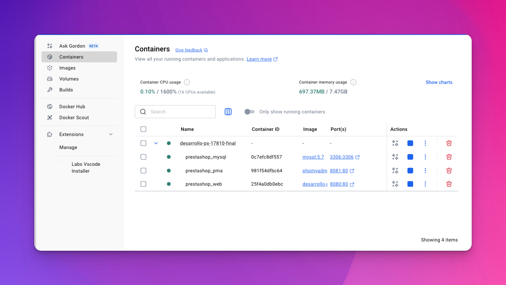

# 1. Verificación del Entorno Docker PrestaShop (Previamente Configurado)

* **Conceptos Clave (Repaso Rápido de la Guía de Preparación):**
  * El `docker-compose.yml` define los servicios (web, db, pma).
  * El `Dockerfile.prestashop` construye la imagen PHP con las extensiones necesarias (incluyendo Xdebug).
  * Los volúmenes montados permiten editar código localmente y verlo reflejado en el contenedor.
* **Actividad de Verificación y Troubleshooting (TODOS JUNTOS):**
  1. Confirmar que se ha clonado el repositorio `desarrollo-ps-1.7.8.10-inicial.git`.
  2. Confirmar que se ha ejecutado `docker-compose up -d --build` y que la salida de `docker-compose ps` muestra los contenedores (`ps178_web_curso`, `ps178_mysql_curso`, `ps178_pma_curso`) como "Up" o "running".
  3. Confirmar que pueden acceder a su tienda (`http://localhost:8080`), al Back Office (con la carpeta admin renombrada) y a phpMyAdmin (`http://localhost:8081`).
  4. **Momento Clave:** Dedicar tiempo a ayudar individualmente a quienes tuvieron problemas para completar la guía de preparación. El objetivo es que todos tengan el entorno funcionando.
*   **Recurso Visual:**

    * Revisar el diagrama de los contenedores y sus puertos.

    <figure><figcaption></figcaption></figure>
